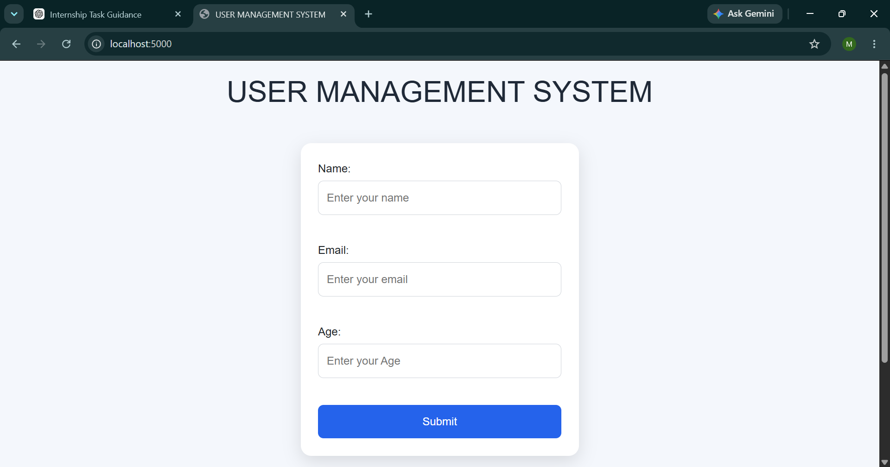
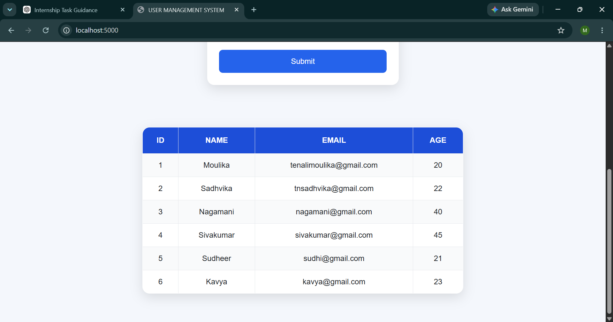

# User Management System

A web-based User Management System built using Flask, SQLite, HTML, CSS, and Bootstrap. This application allows users to add and view user records through a simple and responsive interface.

## Features

* Add new users
* Store user information in SQLite database
* Display all users in a structured table
* Form validation using HTML attributes
* Responsive and clean user interface
* Dynamic data rendering using Jinja Templates

## Technologies Used

* Python
* Flask
* SQLite
* HTML5
* CSS3
* Bootstrap 5
* Jinja2

## Project Structure

```text
User-Management-System/
│
├── app.py
├── create_db.py
├── delete_users.py
├── check_db.py
│
├── templates/
│   └── index.html
│
├── static/
│   └── style.css
│
├── README.md
└── .gitignore
```

## Installation and Setup

### 1. Clone the Repository

```bash
git clone <repository-url>
cd User-Management-System
```

### 2. Install Dependencies

```bash
pip install flask
```

### 3. Create the Database

```bash
python create_db.py
```

### 4. Run the Application

```bash
python app.py
```

### 5. Open in Browser

```text
http://127.0.0.1:5000
```

## Learning Outcomes

This project helped in understanding:

* Flask Routing
* GET and POST Requests
* Form Handling
* SQLite Database Integration
* SQL Queries
* Jinja Templates
* Frontend and Backend Integration

## Future Enhancements

* Edit User Information
* Delete User Functionality
* Search Users
* User Authentication
* Pagination
* Dashboard Statistics

## Screenshots

### Home Page



### User Records



## Author

Moulika Tenali
B.Tech Computer Science Engineering